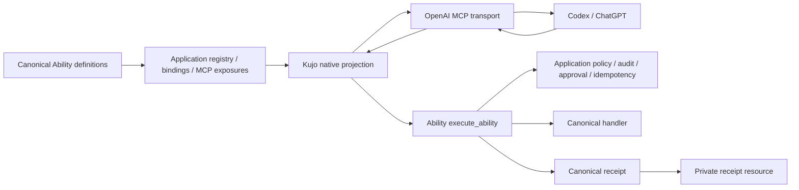

# Architecture and projection contract

## Ownership

`src/projection.kujo` consumes the pinned, unchanged Ability implementation. It discovers only enabled MCP exposures with bindings and application-approved visibility. `invoke` repeats discovery, resolves the exact Ability/version/digest, constructs a canonical invocation and delegates to `execute_ability`.

The application is trusted installed code. Repository content cannot choose its entrypoint, module paths, runtime, principal or services. `lib/backend.mjs` launches one bounded process per operation using an operator configuration. No shell interpolation; arguments travel over bounded stdin. The application owns durable state because each call has a fresh process. In-memory approvals or idempotency maps are unsuitable here.

Node's official MCP SDK handles protocol negotiation and dispatch. The bounded transport adds input framing, lifecycle and concurrency guards. The process backend handles quotas, timeout and cancellation. Cancellation kills the process group on macOS/Linux; it cannot undo effects or kill a deliberately detached descendant. Such execution requires external isolation.

## Projection

| Ability source | MCP representation |
|---|---|
| ID + exact version | readable 26-character prefix + underscore + first 32 SHA-256 hex digits of `id@version` |
| Title / description | unchanged, title falls back to canonical ID |
| Input / output JSON Schema | unchanged; object roots required by this host |
| All read effects | `readOnlyHint: true`, otherwise false |
| Any non-read effect | `destructiveHint: true` conservatively |
| Open-world unknown in v1 | `openWorldHint: true` conservatively |
| Intrinsic idempotency | `idempotentHint: true`; keyed and none false |
| Canonical digest / effects / idempotency | namespaced `_meta` |
| Policy / approval / retry | enforced by canonical runtime/application, not descriptors |

Names are at most 59 ASCII characters, deterministic and stable for one ID/version. Catalog reverse lookup is exact; underscore decoding is prohibited. Cryptographic truncation cannot mathematically eliminate collisions: the registry detects any actual duplicate and rejects the catalog. Do not vary names based on insertion order or catalog neighbors. Multiple exact versions can coexist.

A read effect does not prove a closed world. A write can be destructive without a delete effect. Execution is not a distinct Ability v1 effect. Do not infer any of these from names/resources/descriptions. Local conservative hints are deliberately imprecise; publication needs reviewed host-neutral semantics. No incompatible Ability contract change is introduced.

Unsupported scalar schemas or missing bindings appear in the operator catalog's `unsupported` array. Unexposed/invisible Abilities are omitted without leaking their IDs. The MCP tool list contains supported tools only. No arbitrary call escape hatch is present.

## Results and evidence

Successful `structuredContent` is exactly `receipt.result`, validated against the advertised output schema. Text contains a small status/identity/reference summary plus result text for clients lacking structured-result support. Failed calls have `isError: true`, preserve the canonical status/error, and do not masquerade as successful domain output.

The adapter verifies response identity against discovery and invocation, then durably stores the complete canonical receipt without rewriting it. Content-addressed `kujo-receipt://sha256/<digest>` references can be read with MCP `resources/read`; receipts are not globally enumerated. Private files use exclusive creation, no-follow opens, fsync and content verification. Existing records survive server restarts. The local store is single-operator, not a multi-tenant authorization design. Operators own retention, backups, disk quotas and deletion.

Canonical receipts contain execution identity, handler/version, status, result/error, policy, approval reference, idempotency, timing, principal and audit/provenance metadata. They do not necessarily include input bytes or an input hash. Application audit must preserve safe input references when required. The adapter must not silently modify a canonical receipt to claim evidence that was never emitted. Hashes detect modification; they are not third-party signatures.

## Failures and retry

Canonical `succeeded`, `failed`, `rejected`, `approval_required`, `in_progress`, `cancelled` and `timed_out` statuses survive. An evaluation `passed: false` can be a successful execution; skills must report both.

Pre-admission configuration/capacity/unknown-tool errors are `not_executed`. Timeout, cancellation after launch, malformed execution response, wrong receipt identity or persistence failure after execution become `completion_uncertain`. No fabricated canonical receipt is created. Reconcile with the application's durable audit before retrying. The adapter makes exactly one execution attempt and does not convert keyed idempotency into automatic retry permission.

Transport arguments cannot carry principal, approval, policy or idempotency controls. Application code may inject independently resolved context into `invoke`. The stdio reference transport does not implement resumable human approval or stable keyed-call continuation. Those calls remain blocked unless the trusted application resolves them within its operation. This is an explicit milestone limitation.
