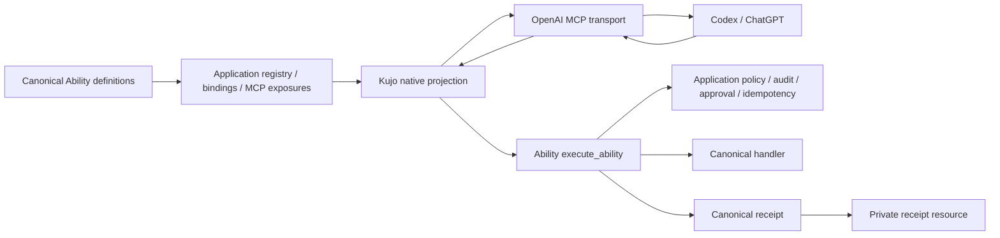

# Architecture and projection contract

## Ownership

`src/projection.kujo` consumes the pinned, unchanged Ability implementation. It discovers only enabled MCP exposures with bindings and application-approved visibility. `invoke` repeats discovery, resolves the exact Ability/version/digest, constructs a canonical invocation and delegates to `execute_ability`.

The application is trusted installed code. Repository content cannot choose its entrypoint, module paths, runtime, principal or services. `lib/backend.mjs` launches one bounded process per operation using an operator configuration. No shell interpolation; arguments travel over bounded stdin. The application owns durable state because each call has a fresh process. In-memory approvals or idempotency maps are unsuitable here.

Node's official MCP SDK handles protocol negotiation and dispatch. The bounded transport adds input framing, lifecycle and concurrency guards. The process backend handles quotas, timeout and cancellation. On macOS/Linux cancellation first sends SIGTERM so Kujo can terminate its isolated native subprocess groups, then escalates after 500 ms to SIGKILL of the provider group. The host closes retained pipes and reports uncertain completion at that bound. Cancellation cannot undo effects or guarantee termination of a deliberately detached descendant. Windows currently kills only the provider; process-tree containment remains uncertified. Such execution requires external isolation.

## Projection

| Ability source | MCP representation |
|---|---|
| ID + exact version | readable 26-character prefix + underscore + first 32 SHA-256 hex digits of `id@version` |
| Title / description | unchanged, title falls back to canonical ID |
| Input / output JSON Schema | unchanged; object roots required by this host |
| All read effects | `readOnlyHint: true`, otherwise false |
| Explicit `semantics.destructive` | exact `destructiveHint`; otherwise any non-read effect defaults true |
| Explicit `semantics.open_world` | exact `openWorldHint`; otherwise true |
| Intrinsic idempotency | `idempotentHint: true`; keyed and none false |
| Canonical digest / effects / idempotency | namespaced `_meta` |
| Policy / approval / retry | enforced by canonical runtime/application, not descriptors |

Names are at most 59 ASCII characters, deterministic and stable for one ID/version. Catalog reverse lookup is exact; underscore decoding is prohibited. Cryptographic truncation cannot mathematically eliminate collisions: the registry detects any actual duplicate and rejects the catalog. Do not vary names based on insertion order or catalog neighbors. Multiple exact versions can coexist.

A read effect does not prove a closed world. A write can be destructive without a delete effect. Execution is not a distinct Ability v1 effect. Do not infer any of these from names/resources/descriptions. Ability now accepts optional complete host-neutral `semantics` facts, validated in native Kujo and both SDKs. The adapter projects those facts without overrides and preserves `executes_code` in metadata. Definitions without facts retain conservative hints. Facts affect the canonical digest but never grant execution authority. Older strict readers must be upgraded before consuming enriched definitions; existing definitions and digests are unchanged. See Ability’s `docs/effect-semantics.md`.

Unsupported scalar schemas or missing bindings appear in the operator catalog's `unsupported` array. Unexposed/invisible Abilities are omitted without leaking their IDs. The MCP tool list contains supported tools only. No arbitrary call escape hatch is present.

## Results and evidence

Successful `structuredContent` is exactly `receipt.result`, validated against the advertised output schema. Text contains a small status/identity/reference summary plus result text for clients lacking structured-result support. Failed calls have `isError: true`, preserve the canonical status/error, and do not masquerade as successful domain output.

The adapter verifies response identity against discovery and invocation, then durably stores the complete canonical receipt without rewriting it. Content-addressed `kujo-receipt://sha256/<digest>` references can be read with MCP `resources/read`; the resource API does not enumerate receipts. Private files use exclusive creation, no-follow opens, fsync and content verification. The store probes directory fsync at initialization and rejects unsupported filesystems before execution. Windows uses the SQLite store below because Node directory fsync fails this preflight. Existing records survive server restarts. The local store is single-operator, not a multi-tenant authorization design. Operators own retention, backups, disk quotas and deletion.

Canonical receipts contain execution identity, handler/version, status, result/error, policy, approval reference, idempotency, timing, principal and audit/provenance metadata. They do not necessarily include input bytes or an input hash. Application audit must preserve safe input references when required. The adapter must not silently modify a canonical receipt to claim evidence that was never emitted. Hashes detect modification; they are not third-party signatures.

## Failures and retry

Canonical `succeeded`, `failed`, `rejected`, `approval_required`, `in_progress`, `cancelled` and `timed_out` statuses survive. An evaluation `passed: false` can be a successful execution; skills must report both.

Pre-admission configuration/capacity/unknown-tool errors are `not_executed`. Timeout, cancellation after launch, malformed execution response, wrong receipt identity or persistence failure after execution become `completion_uncertain`. No fabricated canonical receipt is created. Reconcile with the application's durable audit before retrying. The adapter makes exactly one execution attempt and does not convert keyed idempotency into automatic retry permission.

Transport arguments cannot carry principal, approval, policy or idempotency controls. Application code may inject independently resolved context into `invoke`. The stdio reference transport does not implement resumable human approval or stable keyed-call continuation. Those calls remain blocked unless the trusted application resolves them within its operation. This is an explicit milestone limitation.

## Model-visible receipt evidence

Some ChatGPT paths retain canonical `structuredContent` but do not expose receipt references from text or `_meta` to the model. `_kujo_receipt_evidence` bridges the existing receipt resource API into structured tool output. It is host infrastructure, not a newly invented Ability. Canonical tool names, schemas, domain results and receipts remain unchanged. It never invokes an Ability or grants authority.

With `receipt_uri`, the helper returns the original integrity-checked receipt. With `{}`, it returns references and identity/status/timing summaries for at most 32 most recently persisted distinct receipts in this store instance. Failed and denied receipts remain identifiable. The index resets on process/store restart; persisted receipts remain readable by known URI. It is not exhaustive, chat-specific, or proof that the newest receipt belongs to the current conversation. Match Ability ID, invocation and timestamps before attributing evidence.

Local access follows the existing single-operator receipt boundary. Remote access filters and rechecks subject, tenant and issuer through the same authenticated receipt resource guard; it requires the existing `mcp:read ability:invoke` tool-call scopes. A shared remote store index covers the last 32 global entries before principal filtering, so a user's older entries may be absent. Absence is not evidence that a call never ran. Custom stores without `recent()` retain resource reads and do not advertise this optional helper.

The leading underscore reserves the helper outside generated canonical Ability tool names. Missing, corrupt, unauthorized and symlink receipts return a generic failure without filesystem or principal diagnostics. This helper has protocol/isolation coverage; live ChatGPT visibility must be verified separately after the host refreshes its tool catalog.

### Native SQLite receipt store

`SqliteReceiptStore` is selected automatically on Windows; other systems retain
the existing file store. It keeps identical JSON bytes and SHA-256 references, uses parameterized
SQL, checks database/journal paths, and closes each connection after the operation.
It uses Node's bundled SQLite (Node >=22.13), with extension loading disabled,
`trusted_schema=OFF`, DELETE journaling, `synchronous=EXTRA`, and fullfsync enabled.
Publication follows transaction commit; duplicates must match the original bytes.
The store preserves the bounded instance-local recent index and verifies hashes
on reads. SQLite owns native locks, rollback and filesystem flushing.

The native Windows VFS uses FlushFileBuffers, avoiding an unsupported Node
directory-fsync call. This is a local-filesystem design; network shares and
multi-tenant authorization are unsupported. As with the file store, durability
depends on honest OS/device flush semantics; no software test proves arbitrary
hardware power-loss behavior. Concurrent subprocess writers, writer termination
after commit, reopening, tampering and linked-file rejection are tested on the
three-OS CI matrix (run 36802667616 passed all storage jobs). This proves the
storage contract; it does not establish runtime or process containment support.

Sources accessed 2026-09-30:
- https://sqlite.org/atomiccommit.html (native commit and flush semantics)
- https://sqlite.org/pragma.html#pragma_synchronous (EXTRA durability)
- https://nodejs.org/download/release/v22.13.1/docs/api/sqlite.html (bundled API)
