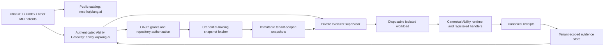

# Hosted Kujo execution design

Status: proposed deployment architecture; design authorized on 2026-10-01.
No production configuration, onboarding policy, secrets, or infrastructure changed.

## Decision

Reuse **Kujo Ability Gateway** at `https://ability.kujolang.ai/mcp` as the
authenticated service boundary. Keep `https://mcp.kujolang.ai/mcp` as the
anonymous, stateless catalog. The verified brand/domain is **kujolang.ai**.

Do not add repository credentials, execution bindings, a privileged proxy, or
private result storage to the public catalog Worker. This follows the existing
MCP [ADR 0001](https://github.com/kujolang/mcp/blob/8c570be5bc4b4ced9ae3a7cbef6c6e152b3eedf4/docs/adr/0001-universal-ability-platform.md).
A second origin already exists; a new plugin-specific service is unnecessary.
The hosted service should work with authorized standards-compliant MCP clients,
with ChatGPT Skills and presentation as an additive host layer.

Execution necessarily introduces attack surface and operating costs. Separate
principals, deployments, secrets and data stores limit the blast radius; they
cannot justify a claim of zero additional risk.

## Implementation evidence, not README assumptions

Inspected local revisions on 2026-10-01:

| Component / revision | Reusable implementation | Gap before hosted repository reviews |
| --- | --- | --- |
| `kujolang-mcp` `07e13a46e1f71632d3126e46f9f0f8889a159412` | Generated `dist/worker.js`, seven deterministic catalog tools, no execution | No identity or execution layer; intentionally leave this deployment separate |
| `ability-gateway` `d7934e267826aba2525c042e56cc6e74a460e547` | `src/index.ts` OAuth provider, `auth.ts` consent, D1 membership/quotas, protected MCP | `auth.ts` assigns `tenant_kujolang`; organization membership is required. Public tenant provisioning is absent |
| Same gateway | `src/mcp.ts`, `src/api.ts`, `src/catalog.ts` implement bounded fixture execution and tenant catalog | Calls special-case `gateway.echo` / `gateway.publish-preview`; audit objects are not canonical Ability receipts. Stored projected descriptors cannot become canonical definitions |
| `kujo-openai` `4b4bf94` | `src/projection.kujo`, `lib/remote-adapter.mjs`, `lib/remote.mjs`, canonical receipts and exact digest admission | Production binding, repository grant store, snapshot provider and physical execution isolation are absent |
| Same adapter | Canonical repository-review pack in `vendor/ability/packs/repository_review/runtime.kujo` | Empty input schema and descriptions explicitly target an operator-configured local worktree. Do not relabel committed remote snapshots as local uncommitted changes |
| `workcell` `0f9595b79872d2500f0bb35a8cf6227171fd7eeb` | Stable bounded Docker/Podman lifecycle and cleanup; provider-neutral alpha interfaces | Stable local OCI isolation is not hosted multi-tenant certification. Cloudflare bridge is deferred, not a ready provider |

Live read-only observations: catalog health returned 200 and catalog revision
`1d9fbdcc0765cee651dd7baeb90f6fa28474433c8ab22072ed2406c66a27bf61`.
Gateway root returned controlled-beta; protected-resource and authorization
metadata returned 200 using curl; anonymous MCP GET returned 401 with a
protected-resource challenge. Python urllib requests received 403, so client/edge
compatibility requires investigation in staging. No authenticated production
execution or account onboarding was tested.

Baseline verification: gateway `npm run check` passed type checking, 44 tests in
seven files and boundary lint. Catalog `worker_contract_test.mjs` passed six
native/Worker item comparisons, installer profiles, discovery, invalid inputs and
HTTP guards using the adapter's published Kujo 1.7 runtime. The first catalog
attempt lacked `kujo` on PATH; the explicit runtime rerun passed. Neither result
certifies the proposed executor.

## Service and ownership boundaries

- `ability-gateway` owns client authentication, onboarding, grants, repository
  selection, quotas, job admission, retention and private executor communication.
- `ability` owns definitions, schemas, effects, authority, snapshot-aware pack
  contracts and canonical receipts. Add host-neutral contracts there first.
- Reuse the adapter's generic projection and receipt verification for execution;
  do not duplicate product schemas or carry the gateway's fixture switch forward.
- Workcell may own workload lifecycle/evidence once the selected deployment
  profile is certified. Its receipt supplements, never replaces, Ability's.
- Public catalog content may link to the authenticated service after release.
  It receives no service binding or credentials that could invoke it.
- ChatGPT packaging uses the authenticated endpoint as its single MCP connection.
  Do not combine private discovery with anonymous catalog caching.

The existing gateway Worker cannot simply import the Node process backend.
Keep OAuth termination in the Worker. A private supervisor hosts canonical
projection/execution and returns descriptors/results. Replace fixture dispatch
with this generic bridge in staging, keeping existing beta routes compatible
until migration passes. Do not publish two diverging catalogs or change tool
names between discovery and call.

Worker-to-supervisor admission uses an authenticated private channel plus a
short-lived, audience-bound, single-use work authorization bound to principal,
tenant, canonical identity/version/digest, binding/image digest, normalized
input hash, snapshot, deadline and invocation ID. Public forwarding headers,
MCP session IDs and model arguments cannot construct that authorization.
The supervisor consumes it atomically before execution; a replay returns the
existing invocation state, never starts another workload. Credentials and raw
authorization tokens do not reach the workload.

The adapter's introspection verifier is not a drop-in verifier for the gateway:
no RFC 7662 endpoint was established in this inspection. Reuse the gateway's
provider-validated identity at the edge; implement and test the private work
authorization boundary explicitly. Reuse `createRemoteAdapter` only after the
private supervisor has independently verified that boundary.

## Authentication and onboarding

Retain the existing Workers OAuth provider rather than implement OAuth again.
Verify its pinned version and actual deployment against current OpenAI
requirements before promotion. MCP OAuth authenticates a Kujo account; GitHub
repository consent is a separate grant.

The current OpenAI contract requires authorization code with PKCE S256, resource
metadata, audience/resource binding, supported client registration and token
checks on each request. CIMD is preferred where supported; retain tested DCR or
predefined clients for other MCP hosts. Use exact host-provided redirects, never
guess them. Per-tool security schemes and reauthorization challenges must agree.
OpenAI client mTLS can be additive; requiring only OpenAI certificates on the
universal endpoint would exclude other clients. [OpenAI authentication](https://developers.openai.com/plugins/build/auth)

Public onboarding must replace the hard-coded tenant assignment with
server-owned tenant membership. Personal tenants are initially private to one
verified subject; organization sharing is deferred. The tenant comes from
validated membership, never a request parameter. Existing beta grants must not
gain access through this migration. Retain revocation checks, quotas and explicit
consent. No anonymous repository computation at launch.

The user flow is: install plugin → connect Kujo → authorize selected GitHub
repositories → select a repository and immutable review context → run reviews.
There is no local binary installation. Remote execution cannot see uncommitted
files on the user's laptop; users must push a branch or use the separate local
integration. Display this limitation before asking for repository access.

## Repository grants and snapshots

Use a GitHub App with selected-repository access and read-only Contents/Metadata;
add Pull requests read only if the first shipped workflow needs PR selection.
No Issues/Checks/Actions/Contents write permissions. Prefer user-to-server tokens
for interactive reads so GitHub enforces the intersection of user access, app
permissions and installation access. Organization installation alone is not
proof a particular user can read every installed repository.
[GitHub user authorization](https://docs.github.com/en/apps/creating-github-apps/authenticating-with-a-github-app/authenticating-with-a-github-app-on-behalf-of-a-user)

Encrypted provider credentials stay in the fetcher/control plane. Rotation and
refresh are serialized; disconnect, installation removal and permission changes
invalidate grants and pending work. Signed webhook delivery IDs are deduplicated,
but missed webhooks cannot confer access: recheck provider permission when
preparing a snapshot and check the local grant again on execution and retrieval.
Denial or provider uncertainty fails closed. Never use the operator's GitHub token
as a fallback. If installation tokens become necessary, restrict them to the
specific repository and permissions; they do not replace subject authorization.
[GitHub installation tokens](https://docs.github.com/en/apps/creating-github-apps/authenticating-with-a-github-app/authenticating-as-a-github-app-installation)

Store server-issued opaque repository and review-context IDs. An authenticated
browser flow creates a context bound to tenant, subject, repository numeric ID,
installation/grant generation, exact base/head commit OIDs, snapshot content
digest, expiry and source manifest. IDs are references, not bearer authority.
No mutable global “current repository” shared across chats or users.

Resolve refs through GitHub, then fetch exact objects with bounded requests.
Do not accept arbitrary Git URLs, credentials, local paths or caller-selected
origins. Restrict redirects to documented provider endpoints, strip auth across
origins, and bound compressed/uncompressed bytes, object count and depth.
Reject traversal, absolute paths, symlinks/hardlinks/devices and unsupported
submodules/LFS for the first profile; report unsupported rather than silently
omitting content. Construct a sanitized Git database/worktree from verified
objects with a generated configuration. Do not import hooks, filters,
credential helpers, alternates or repository-supplied runtime configuration.

Starting limits, to validate under load: two in-flight reviews per subject,
100 MiB expanded snapshot, 20,000 files, 2 MiB per text file, 60-second admission
deadline, 512 KiB tool output. Exceeding a bound is explicit and does not produce
an apparently complete review. These are proposed operating defaults, not
measured service guarantees.

A canonical, host-neutral snapshot-review pack must accept the opaque context
reference and distinguish committed base/head comparison from local worktree
inspection. Preserve the local pack unchanged. Use one shared context resolver
and the canonical handlers, not OpenAI wrappers for each product. Repository
selection/snapshot preparation starts as authenticated control-plane UI, outside
read-only Ability calls; any later model-callable preparation must be its own
canonical Ability with honest network/storage effects and separate certification.

## First execution profile

Only certified deterministic inspection on an immutable snapshot. No repository
test scripts, dependency installation, builds, arbitrary shell commands,
Dispatch workflows, publishing, mutation or model-generated code. PatchBrief,
ChangeBucket and ShipCheck are candidates after their snapshot semantics and
handlers pass certification, not automatically authorized because their names
or read annotations look safe.

A trusted CLI subprocess is implementation machinery, not permission to execute
repository code. Preserve canonical semantics; do not toggle `executes_code`
or effects in the adapter to pass admission. Certification pins definition,
binding, product source, runtime and image digests together. Approval policy
still runs inside Ability. First-profile approval-required calls remain blocked.

Each invocation gets a disposable isolation unit, read-only input, bounded
scratch space, fixed entrypoint/environment, no provider credentials, no daemon
socket, no host mounts and no public ingress. Deny workload egress including
metadata/private addresses, DNS and IPv6 paths; the fetcher obtains sources
beforehand. Destroy the isolation unit on success, cancellation or timeout;
reconcile uncertain outcomes and orphan ownership before retry.

Cloudflare Containers are a candidate because the control plane already uses
Cloudflare. Current docs describe microVM isolation and require Workers Paid.
A normal catalog Worker is not this executor.
[Cloudflare environments](https://developers.cloudflare.com/sandbox/concepts/),
[availability](https://developers.cloudflare.com/sandbox/).
Workcell's Cloudflare bridge remains deferred; do not describe it as available.
A dedicated Linux/Workcell staging worker is an alternative for controlled
testing, not proof of public multi-tenant isolation. Select and budget the
production provider before provisioning.

## Evidence, storage and failures

Persist the original canonical receipt and validate its identity/digest/principal.
Keep a separate authenticated provenance envelope linking source snapshot,
definition/binding/image, policy decision, invocation, lifecycle receipt and
storage integrity. A content hash is integrity evidence, not a signature or proof
of execution. Do not manufacture canonical receipts from gateway audit rows.

Use tenant+subject+invocation storage keys and check ownership on every read,
including cache hits and known receipt URIs. Retain no credentials in prompts,
results or logs. Source may itself contain secrets: minimize returned excerpts,
use canonical output policies, and never silently rewrite a receipt to redact it.
If a result cannot safely be exposed, withhold it and report that explicitly.

Proposed retention: delete workspace immediately after reconciliation; expire
snapshots within one hour; retain private canonical receipts for 30 days with
user deletion/export. Implement tombstones, object deletion, backup expiry and
cost ceilings before promising those durations. Receipt access after repository
revocation is denied; account-level deletion remains possible.

Keep `not_executed`, denial, unsupported profile, failure, timeout and uncertain
completion distinct. No automatic execution retries. Start synchronous bounded
reviews; defer long-running jobs rather than introducing another orchestrator.
Every started invocation needs a durable identity and reconciliation record.

## Security acceptance and staged implementation

| Boundary | Required negative evidence |
| --- | --- |
| OAuth / private executor | Wrong issuer/audience/expiry; forged headers; cross-client redirect; replayed work authorization |
| Tenants / repositories | Two users, two tenants, revoked collaborator, removed installation, guessed context/receipt IDs |
| Snapshot input | Traversal, links, decompression bombs, malicious refs, redirect SSRF, Git configuration/hooks |
| Workload | Secret canaries, denied egress/private IP/DNS/IPv6, resource exhaustion, cancellation and detached-process cleanup |
| Canonical contract | Same input/result/schema/receipt as Ability; no descriptor-authority drift; unsupported classes stay blocked |
| Recovery | Crash after launch, after result and before persistence; duplicate call; stale grant; zero-orphan reconciliation |
| Public catalog | All seven tools remain anonymous/read-only; no private bindings, secrets or result caching |

Implementation order:
1. Add snapshot-review contracts/bindings in Ability with local compatibility
   tests, and a generic private executor contract in the gateway.
2. In an isolated staging deployment, replace fixture dispatch with canonical
   projection and add private storage and principal-preserving receipts.
3. Register the read-only GitHub App; implement personal tenant onboarding,
   consent, context preparation, revocation and repository isolation tests.
4. Provision the selected bounded executor, prove lifecycle/egress/recovery
   controls and measure cost; pass two-tenant acceptance and an independent
   security review before public onboarding.
5. Perform live ChatGPT and generic MCP acceptance; finalize publisher policies,
   reviewer account/video, branding, and submission package.

**Operator decisions still required:** production compute provider and spending
ceiling; GitHub App ownership/registration; storage region and retention policy;
incident/support owner. No paid upgrade, App registration, secret creation,
public tenant enablement or deployment is implied by this design document.

All external URLs above were accessed 2026-10-01. Recheck before deployment.
