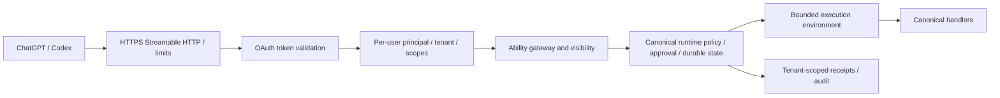

# Remote architecture and authentication plan

The repository now implements an embeddable authenticated Streamable HTTP resource-server boundary. A production deployment, authorization server connection and isolated canonical execution provider are **not yet configured or verified**. Do not expose the local stdio provider or its receipt directory to multiple users. The local CLI does not automatically become a remote server.



## Required operator decisions

Choose the endpoint/domain, authorization server, issuer, audience/resource identifier, supported OAuth client registration mode and exact redirect URI shown by OpenAI. The current official [authentication guide](https://developers.openai.com/plugins/build/auth) requires discovery and PKCE S256. Publish protected-resource metadata and appropriate 401 `WWW-Authenticate` challenges. Support authorization-code flow, resource/audience validation and the selected CIMD/DCR/preconfigured-client path. Validate issuer, signature, expiration, audience, scopes and revocation on every request. Follow issuer-identification requirements for the selected callback mode; do not guess callback URLs.

A profile capability, if supplied, resolves the signed-in account from validated credentials. Models cannot select a principal or tenant. Bind discovery, invocation, receipt access and idempotency keys to the same tenant/principal. Treat session IDs and `_meta` as correlation only. Recheck authorization after revocation and before effects.

## Credential custody

Provider/repository access needs separately consented least-privilege grants. OAuth access to the MCP server is not permission to access every repository. Store encrypted provider tokens under tenant/user identity in the gateway's secret store; never forward them into model input or arbitrary workloads. Use short-lived scoped credentials, refresh rotation, revocation and account disconnect. Keep signing keys and approval credentials out of worker environments. Redact gateway logs and never expose raw OAuth/provider error bodies.

Repository inputs should be immutable bounded snapshots or explicit repository references resolved by the gateway. Do not accept host filesystem paths or unrestricted Git URLs from remote clients. Prevent traversal, symlink breakout, SSRF and unbounded clone/archive expansion. Isolate each tenant's workspace, caches, audit and receipt storage.

## Execution policy

Start with explicitly approved read-only application abilities. A read can still access the internet or secrets; review actual handlers and annotate accurately. Remote support is an allowlist of certified execution classes, not an automatic projection of all locally registered Abilities.

Dispatch, Workcell, shell/process execution, filesystem mutation and repository mutation remain unsupported until their deployment control profile is verified. Workcell owns workload policy/evidence; its provider owns physical compute isolation. Require resource quotas, egress policy, image provenance, ephemeral identity, cancellation, orphan cleanup, durable result reconciliation and cost bounds. Never map a model-produced approval claim to a grant.

Canonical one-time approvals must bind exact definition/input/principal/tenant/invocation and be atomically consumed. Host confirmation is additional. Stable idempotency requires durable transactional storage; timeout/disconnect does not prove that an effect did not happen. Preserve uncertain state and reconcile against authoritative application evidence before retry.

## Acceptance gates before public exposure

- Two-user/two-tenant isolation for discovery, calls, receipts and replay.
- Expired, revoked, wrong-audience, wrong-issuer and insufficient-scope tokens rejected.
- OAuth discovery, PKCE, callback/resource binding and refresh/revoke tested against the actual provider.
- Cross-repository grants, hostile inputs, quota pressure, cancel/restart and orphan cleanup tested.
- Durable approval replay prevention and execution/idempotency/audit failure drills.
- Accurate tool annotations, operational metrics without credentials, retention/deletion policy, backup/restore and incident owner.
- Official MCP Inspector and real ChatGPT acceptance cases, verified domain and review materials.

These are unfulfilled deployment requirements, not assertions implied by local tests. Reuse the existing Ability gateway where its contracts fit, but validate that it executes canonical definitions rather than treating stored projected descriptors as a new source of truth.

## Implemented resource-server boundary

`lib/remote.mjs::createRemoteHandler` accepts Web Standard Requests and returns Responses using the pinned official MCP SDK. It uses stateless JSON responses, exact resource routing, OAuth protected-resource discovery, explicit Origin allowlisting, bounded JSON bodies, global concurrency admission and request deadlines. `mcp:read` is required for protected requests; `ability:invoke` is additionally required for tool calls. Scope admission is a gateway boundary, not a replacement for canonical Ability policy. Projected remote tools declare their OAuth scopes via `securitySchemes`; authenticated tool calls missing invocation scope return an explicit not-executed error with `mcp/www_authenticate` for host reauthorization. Missing or invalid credentials receive an HTTP challenge before any provider is constructed. Unknown origins, bearer query parameters, malformed credentials and batch bodies are rejected. No bearer header is forwarded into the SDK or native execution.

`lib/oauth.mjs::createIntrospectionVerifier` supports an operator-selected HTTPS RFC 7662 endpoint with confidential client authentication. The issuer contract requires `active`, `iss`, `aud`, `exp`, `sub`, `tenant_id`, `scope` and Bearer `token_type`; optional `nbf` is enforced. Issuer/resource must match configured values. Introspection is bounded, follows no redirects and caches no positive result, so a revoked token is checked again on each protected request. Availability failures return 503 with no upstream diagnostics. The issuer's tenant claim must be derived from authoritative membership, not editable user metadata.

This is the resource-server side only. The external issuer must still implement and pass the discovery, authorization-code/PKCE, registration, callback, consent, refresh, revocation and account-disconnect requirements above. The library does not create those endpoints or claim an arbitrary OAuth provider meets OpenAI requirements.

The operator supplies `createBinding(identity, signal)`, returning `{backend, receipts, approvedDigests}`. The callback must select an authorized isolated provider and durable receipt store for that authenticated identity, enforce per-user quotas and repository grants, honor cancellation, and keep credentials out of provider results. It receives only subject, tenant, issuer and scopes, never the bearer token. It must not read selection parameters from model content.

`lib/remote-adapter.mjs` applies additional safeguards around that binding:

- Every provider request receives an adapter-created `trusted_context.principal` of canonical type `user`, with authenticated subject/tenant and issuer/scopes claims. The native provider must consume it as its runtime principal and run canonical policy/audit services. The provider protocol is private authenticated application IPC, never a public endpoint accepting arbitrary principal claims.
- Discovery must declare `capabilities.authenticated_context = "principal-v1"`; legacy local providers fail closed. This declaration is a compatibility handshake, not attestation that a malicious provider is trustworthy.
- Only exact operator-certified definition digests with canonical read effects and explicit closed-world/non-destructive/non-code-execution semantics are admitted. Other definitions are recorded as `unsupported_remote_execution_profile` in the adapter's unsupported catalog. Certification must also review handler integrity, data access, execution isolation and provenance; a read annotation alone is insufficient.
- Returned canonical receipts must carry exactly the expected principal. Receipt reads independently enforce subject, tenant and issuer ownership, including when a storage implementation is accidentally shared. Receipt contents are not rewritten.
- Remote continuations and mutation classes remain unavailable. No local approval or resume reference grants remote authority.

Example application wiring (operator-owned code, not a public configuration API):

```js
import {createRemoteHandler} from './lib/remote.mjs';
import {createIntrospectionVerifier} from './lib/oauth.mjs';
const verifyToken = createIntrospectionVerifier({
  issuer, resource, introspectionEndpoint, clientId, clientSecret
});
const handleRequest = createRemoteHandler({
  resource, issuer, verifyToken,
  createBinding: async (identity, signal) => {
    // Application code resolves membership, certified provider and storage.
    return provisionAuthorizedBinding(identity, signal);
  }
});
```

Mount `handleRequest` behind an HTTPS server/proxy that preserves the configured public URL and propagates disconnect cancellation. Do not derive trusted public URLs or identities from arbitrary forwarding headers. The HTTP server, TLS configuration, per-user quotas, issuer integration, production native provider, credential custody, retention and operational controls remain deployment responsibilities. A global request bound is not tenant resource isolation. The application callbacks must honor the supplied signal; the library cannot forcibly interrupt arbitrary in-process application code.

## Verified scope

`tests/remote.test.mjs` includes five suites for introspection validation/redaction, actual SDK Streamable HTTP requests through the Web Request handler and native Ability execution, separate subject/tenant receipt denial, unsupported catalog admission, scope/revocation checks, malformed/oversized/hostile-origin input, concurrency, cancellation and deadline propagation. These use a controlled introspection fixture and an isolated native provider fixture. They do not certify a live issuer, TLS proxy, OAuth login flow, remote repository sandbox, public deployment or ChatGPT.

Sources checked 2026-09-29: [OpenAI plugin authentication](https://developers.openai.com/plugins/build/auth), [MCP authorization 2025-11-25](https://modelcontextprotocol.io/specification/2025-11-25/basic/authorization), and the pinned MCP SDK 1.31.0 server transport implementation/types.
