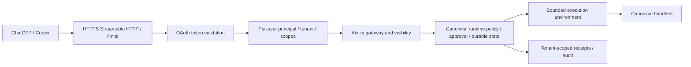

# Remote architecture and authentication plan

Remote hosting is intentionally **not implemented** in this milestone. Do not expose the local stdio provider or its receipt directory to multiple users. The repository provides a reusable native projection seam, not a deployment-ready OAuth gateway.

## Required operator decisions

Choose the endpoint/domain, authorization server, issuer, audience/resource identifier, supported OAuth client registration mode and exact redirect URI shown by OpenAI. The current official [authentication guide](https://developers.openai.com/plugins/build/auth) requires discovery and PKCE S256. Publish protected-resource metadata and appropriate 401 `WWW-Authenticate` challenges. Support authorization-code flow, resource/audience validation and the selected CIMD/DCR/preconfigured-client path. Validate issuer, signature, expiration, audience, scopes and revocation on every request. Follow issuer-identification requirements for the selected callback mode; do not guess callback URLs.

A profile capability, if supplied, resolves the signed-in account from validated credentials. Models cannot select a principal or tenant. Bind discovery, invocation, receipt access and idempotency keys to the same tenant/principal. Treat session IDs and `_meta` as correlation only. Recheck authorization after revocation and before effects.

## Credential custody

Provider/repository access needs separately consented least-privilege grants. OAuth access to the MCP server is not permission to access every repository. Store encrypted provider tokens under tenant/user identity in the gateway's secret store; never forward them into model input or arbitrary workloads. Use short-lived scoped credentials, refresh rotation, revocation and account disconnect. Keep signing keys and approval credentials out of worker environments. Redact gateway logs and never expose raw OAuth/provider error bodies.

Repository inputs should be immutable bounded snapshots or explicit repository references resolved by the gateway. Do not accept host filesystem paths or unrestricted Git URLs from remote clients. Prevent traversal, symlink breakout, SSRF and unbounded clone/archive expansion. Isolate each tenant's workspace, caches, audit and receipt storage.

## Execution policy

Start with explicitly approved read-only application abilities. A read can still access the internet or secrets; review actual handlers and annotate accurately. Remote support is an allowlist of certified execution classes, not an automatic projection of all locally registered Abilities.

Dispatch, Workcell, shell/process execution, filesystem mutation and repository mutation remain unsupported until their deployment control profile is verified. Workcell owns workload policy/evidence; its provider owns physical compute isolation. Require resource quotas, egress policy, image provenance, ephemeral identity, cancellation, orphan cleanup, durable result reconciliation and cost bounds. Never map a model-produced approval claim to a grant.

Canonical one-time approvals must bind exact definition/input/principal/tenant/invocation and be atomically consumed. Host confirmation is additional. Stable idempotency requires durable transactional storage; timeout/disconnect does not prove that an effect did not happen. Preserve uncertain state and reconcile against authoritative application evidence before retry.

## Acceptance gates before public exposure

- Two-user/two-tenant isolation for discovery, calls, receipts and replay.
- Expired, revoked, wrong-audience, wrong-issuer and insufficient-scope tokens rejected.
- OAuth discovery, PKCE, callback/resource binding and refresh/revoke tested against the actual provider.
- Cross-repository grants, hostile inputs, quota pressure, cancel/restart and orphan cleanup tested.
- Durable approval replay prevention and execution/idempotency/audit failure drills.
- Accurate tool annotations, operational metrics without credentials, retention/deletion policy, backup/restore and incident owner.
- Official MCP Inspector and real ChatGPT acceptance cases, verified domain and review materials.

These are unfulfilled deployment requirements, not assertions implied by local tests. Reuse the existing Ability gateway where its contracts fit, but validate that it executes canonical definitions rather than treating stored projected descriptors as a new source of truth.
